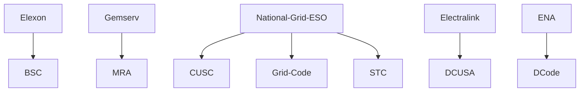

# GB Energy Industry Codes and Agreements

## Electricity Licence

|Code|Managed by|Details|
|-|-|-|
|Elexon|Balancing Settlement Code (BSC)|
|Gemserv|Master Registration Agreement (MRA)|The MRA is an industry-wide agreement that provides governance mechanism to manage the processes established between electricity suppliers and distribution companies to enable electricity suppliers to transfer customers.
|National Grid ESO|Connection and Use of System Code (CUSC)|The CUSC is the contractual framework for connecting to and using the National Electricity Transmission System (NETS).
|National Grid ESO|Grid Code|The Grid Code sets out the operating procedures and principles governing the relationship between The Company and all Users of the National Electricity Transmission System, be they Generators, DC Converter owners, Suppliers or Non-Embedded Customers. The Grid Code specifies day-to-day procedures for both planning and operational purposes and covers both normal and exceptional circumstances.
|National Grid ESO|System Operator Transmission Owner Code (STC)|The STC defines the relationship between the transmission system owners and the system operator. As the code administrator for the STC, we maintain the code and oversee any proposed changes to it. All changes have to be reviewed by the STC modification Panel and approved by the Panel, or by Ofgem.
|Electralink|Distribution Connection and Use of System Agreement (DCUSA)|DCUSA is a multi-party contract between licensed electricity distributors, suppliers and generators in Great Britain concerned with the use of the electricity distribution system.
|Energy Networks Association|Distribution Code (DCode)|Licensed electricity distribution businesses, or Distribution Network Operators (DNOs) in Great Britain, are obliged under Condition 21 of their licences to maintain a Distribution Code detailing the technical parameters and considerations relating to connection to, and use of, their electrical networks.

## Distribution Network Operators
### Distribution Network Operator Map

### DNO List (Distribution Network Operators)
Electricity North West  
**[www.enwl.co.uk](http://www.dcode.org.uk/manager/://www.enwl.co.uk)**

National Grid Electricity Distribution  
**[www.nationalgrid.com/electricity-distribution](https://www.nationalgrid.com/electricity-distribution)**

Northern Powergrid  
**[www.northernpowergrid.com](https://www.northernpowergrid.com/)**  

Scottish and Southern Electricity Networks  
**[www.ssen.co.uk](https://www.ssen.co.uk/)**  

SP Energy Networks  
**[www.spenergynetworks.co.uk](https://www.spenergynetworks.co.uk/)**  

UK Power Networks  
**[www.ukpowernetworks.co.uk](https://www.ukpowernetworks.co.uk/)**

## IDNOs (Independent Distribution Network Operators)

Eclipse Power Networks  
__**[www.eclipsepower.co.uk](http://www.eclipsepower.co.uk/)**__

Energy Assets Networks Limited  
**[www.energyassets.co.uk](https://www.energyassets.co.uk/)**  

ESP Utilities Group  
**[www.espug.com](https://www.espug.com/)**  

GTC (comprising both ETCL and IPNL licences)  
**[www.gtc-uk.co.uk](https://www.gtc-uk.co.uk/)**

Fulcrum Electricity Assets Limited  
**[www.fulcrum.co.uk](http://www.fulcrum.co.uk/)**

Harlaxton Energy Networks Limited
**[www.harlaxtonenergynetworks.co.uk](http://www.harlaxtonenergynetworks.co.uk/)**  

Last Mile  
**[www.lastmile-uk.com](http://www.lastmile-uk.com/)**

Leep Electricity Networks Limited  
**[www.leeputilities.co.uk](https://www.leeputilities.co.uk/)**  

Murphy Power Distribution Limited  
**[www.murphygroup.co.uk](http://www.murphygroup.co.uk/)**  

UK Power Distribution Limited  
**[www.ukpowerdistribution.co.uk](http://www.ukpowerdistribution.co.uk/)**  

Utility Assets Limited  
**[www.utilityassets.co.uk](http://www.utilityassets.co.uk/)**  

Vattenfall Networks Limited  
**[https://networks.vattenfall.co.uk](https://networks.vattenfall.co.uk/)**

[Home](index.md)

